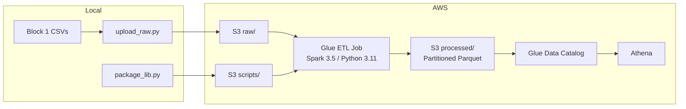

# Cloud ETL — OMOP Batch Pipeline on AWS

Lifts the [Block 1](../genai-block1-batch-pipeline) PySpark batch pipeline to AWS. Raw CSVs go to S3, an AWS Glue job runs the same validate/clean/transform logic, and output lands as query-ready partitioned Parquet in S3 — queryable via Athena. All infrastructure is defined in Terraform.

## Architecture



## Prerequisites

- **AWS account** with permissions to create S3, Glue, IAM, and Athena resources
- **AWS CLI** configured with credentials (`aws configure`)
- **Terraform** >= 1.5
- **Python** >= 3.10 with `boto3` installed
- **Block 1 repo** (`genai-block1-batch-pipeline`) cloned alongside this repo with `data/raw/*.csv` generated

## Setup

```bash
git clone <this-repo>
cd genai-block2-cloud-etl
python -m venv venv
source venv/bin/activate  # Windows: venv\Scripts\activate
pip install -r requirements.txt

cd terraform
terraform init
cd ..
```

## Run Order

Run steps individually or use the all-in-one runner:

### All-in-one

```bash
python scripts/run_all.py
```

Use `--skip-terraform` on re-runs when infrastructure already exists:

```bash
python scripts/run_all.py --skip-terraform
```

### Step-by-step

```bash
# 1. Package Block 1 modules into zip for Glue
python scripts/package_lib.py

# 2. Create AWS infrastructure
cd terraform && terraform apply && cd ..

# 3. Upload raw CSVs to S3
python scripts/upload_raw.py

# 4. Run the Glue ETL job
python scripts/run_glue_job.py

# 5. Verify output
python scripts/verify_output.py
```

## What the Pipeline Does

1. Reads 6 raw CSVs from `s3://bucket/raw/`
2. Validates raw data (detection pass — logs violations, continues)
3. Cleans dirty rows (drops invalid records, logs before/after counts)
4. Validates cleaned data (hard gate — fails the job if violations remain)
5. Builds `analytic_person` table (joins + aggregations)
6. Writes partitioned Parquet to `s3://bucket/processed/analytic_person/`
7. Writes `pipeline_metrics.json` to `s3://bucket/processed/`

## Querying with Athena

After the Glue job completes, query the output in the AWS Console or via the CLI:

```sql
SELECT year_of_birth_band, COUNT(*) AS cnt
FROM omop_cloud_etl.analytic_person
GROUP BY 1 ORDER BY 1;
```

## Cost Estimate

| Service | Estimated Monthly Cost | Notes |
|---|---|---|
| S3 | < $0.01 | ~50 MB raw + processed |
| Glue | ~$0.05-0.15 per run | 2 G.1X workers, ~2-5 min runtime |
| Athena | < $0.01 per query | ~5 MB scanned per query |
| Data Catalog | Free | First million objects free |
| **Total** | **< $1/month** | With occasional runs for development |

## Teardown

Remove all AWS resources:

```bash
cd terraform
terraform destroy
```

This deletes the S3 bucket (including all objects), Glue job, Glue catalog, IAM role, and Athena workgroup.

## Project Structure

```
genai-block2-cloud-etl/
├── glue/
│   ├── etl_job.py            # Glue job script (S3 I/O + orchestration)
│   ├── pipeline_lib.zip      # Block 1 modules packaged for --extra-py-files
│   └── smoke_test.py         # One-off import verification (Phase 3)
├── scripts/
│   ├── package_lib.py        # Zip Block 1 modules for Glue
│   ├── upload_raw.py         # Upload CSVs to S3
│   ├── run_smoke_test.py     # Run smoke test as temporary Glue job
│   ├── run_glue_job.py       # Trigger ETL job and poll for completion
│   ├── verify_output.py      # Verify Parquet, metrics, and Athena query
│   └── run_all.py            # Full pipeline runner
├── terraform/
│   ├── main.tf               # Provider config
│   ├── variables.tf          # Bucket name, region, tags
│   ├── s3.tf                 # S3 bucket + lifecycle
│   ├── iam.tf                # Glue execution role + policy
│   ├── glue.tf               # Glue database, catalog table, job, S3 uploads
│   ├── athena.tf             # Athena workgroup
│   └── outputs.tf            # Bucket ARN, job name, workgroup
├── docs/
│   ├── spec.md               # Project specification
│   ├── plan.md               # Implementation plan
│   └── tasks.md              # Task breakdown by phase
└── requirements.txt
```

## Idempotency

The pipeline is designed for safe re-runs:
- Glue job bookmarks are disabled — all input files are processed every run
- Parquet output uses `mode("overwrite")` — clears and rewrites the output directory
- Same input CSVs + same logic = identical output

## AI-Assisted Workflow

This project was built with Claude Code as an AI pair programmer.

**Where I corrected the AI:** The AI had `terraform apply` listed after CSV upload in the Phase 2 task ordering. I corrected the order — the S3 bucket must exist before uploading CSVs, so `terraform apply` must run first.

**Where the AI corrected the workflow:** The smoke test revealed that Block 1 modules use `from src.X import` which fails in Glue's flat zip layout. The AI rewrote `scripts/package_lib.py` to transform `from src.*` imports to flat imports and inline `REFERENCE_DATE` from `config.py` (which is not packaged). It also built `scripts/run_smoke_test.py` with automatic cleanup of the temporary Glue job and S3 object after the test passes.
