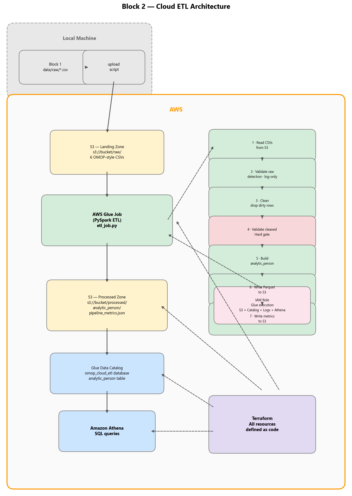
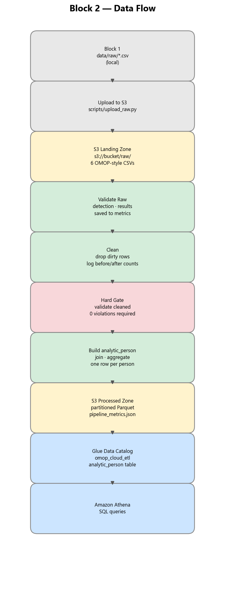
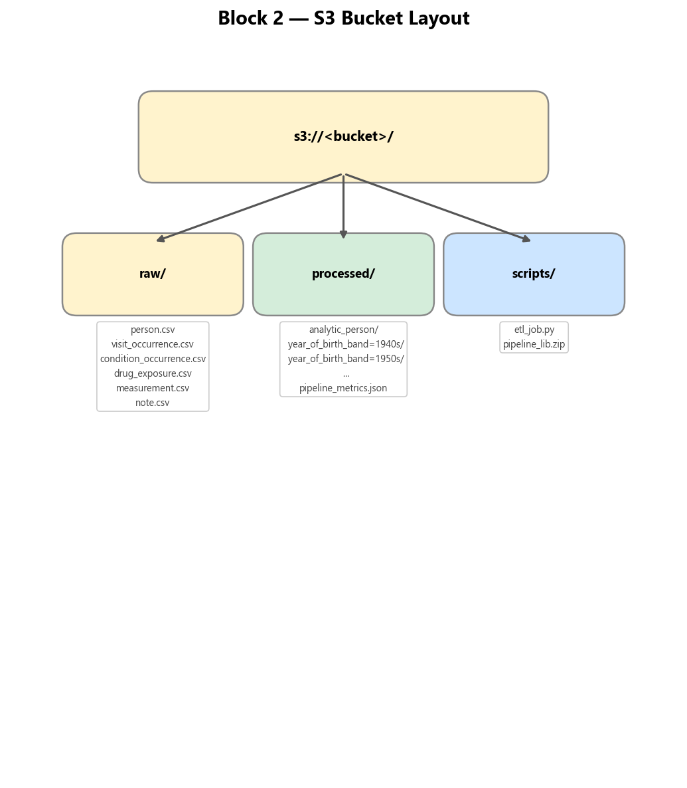
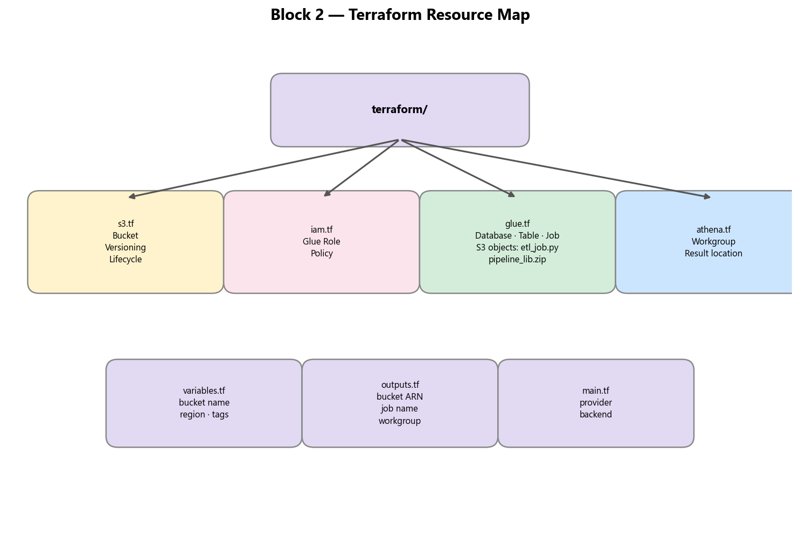

# Block 2 Specification

## Project title

Cloud ETL — Lift the OMOP Batch Pipeline to AWS

## Acceptance criteria (from study plan)

> **Project — Lift the pipeline to AWS**
> Acceptance criteria (done = all true):
> Raw data lands in S3, is transformed by Glue (or equivalent), and is query-ready; all infrastructure defined as code (Terraform/CDK), not clicked in the console; pipeline is idempotent (re-runs produce the same result); a cost estimate is documented in the README.

## Goal

Move the Block 1 PySpark batch pipeline to AWS so that:
- raw data lives in S3
- transformation runs as an AWS Glue job
- output is query-ready (Athena)
- all infrastructure is defined as code (Terraform)
- the pipeline is idempotent
- cost is estimated and documented

Block 2 focuses on:
- S3 bucket layout and lifecycle
- AWS Glue job(s) porting the Block 1 PySpark logic
- Athena/Glue Catalog for query-ready output
- Terraform for all infrastructure
- idempotent, re-runnable pipeline design
- cost estimation

Block 2 does not focus on:
- real-time / streaming ingestion
- orchestration beyond a single Glue job trigger
- multi-account or multi-region setups
- CI/CD (deferred to Block 8 capstone)
- new tables or schema changes beyond Block 1

## Problem statement

Block 1 proved the pipeline locally: Synthea → generator → PySpark validation/cleaning/transform → partitioned Parquet. A local pipeline doesn't demonstrate cloud engineering skills. Block 2 lifts the same logic to AWS to build:
- cloud storage design (S3 landing/processed zones)
- managed Spark execution (Glue)
- self-service analytics (Athena)
- infrastructure as code discipline (Terraform)

The healthcare dataset and transformation logic stay the same. The engineering challenge is the cloud migration itself.

## Relationship to Block 1

Block 1 artifacts reused:
- `data/raw/` CSV files (uploaded to S3 as the landing zone input)
- PySpark transformation logic (`validations.py`, `transforms.py`, `schemas.py`, `concepts.py`)
- Pipeline orchestration pattern (read → validate → clean → validate-gate → build → write)
- `pipeline_metrics.json` structure (adapted for cloud paths)

Block 1 artifacts NOT reused:
- `generator.py` / Synthea (data generation stays local; Block 2 consumes the already-generated CSVs)
- `io_utils.py` (replaced by Glue-native S3 read/write)
- Local paths in `config.py` (replaced by S3 URIs)

## Architecture



## Data flow



## S3 bucket layout



## Glue job design

A single Glue job (`etl_job.py`) runs the same pipeline stages as Block 1:

1. Read CSVs from `s3://bucket/raw/` with explicit schemas
2. Validate raw data (detection pass — log violations, continue)
3. Clean dirty rows (drop/quarantine, log before/after counts)
4. Validate cleaned data (hard gate — fail job if violations remain)
5. Build `analytic_person` (joins + aggregations)
6. Write partitioned Parquet to `s3://bucket/processed/analytic_person/`
7. Write `pipeline_metrics.json` to `s3://bucket/processed/`

The job uses Glue's built-in PySpark runtime. Block 1's core modules (`validations.py`, `transforms.py`, `schemas.py`, `concepts.py`) are packaged as a zip and uploaded to S3 alongside the job script. The Glue job references this zip via `--extra-py-files`, so the modules are importable as-is — no adaptation, no inlining. `etl_job.py` handles only S3 I/O and orchestration, mirroring `pipeline.py` from Block 1. This keeps the tested Block 1 logic intact and reusable in later blocks (e.g., Block 8 capstone).

### Idempotency

- The Glue job overwrites `s3://bucket/processed/` on each run (Spark `mode="overwrite"`)
- Same input CSVs + same job logic = same output (deterministic transforms, no random state)
- No append-only or versioned writes — clean overwrite is sufficient at this scale

### Job parameters

The Glue job accepts parameters for:
- `--S3_BUCKET`: bucket name
- `--RAW_PREFIX`: path to raw CSVs (default: `raw/`)
- `--PROCESSED_PREFIX`: path to processed output (default: `processed/`)

## Glue Data Catalog + Athena

Terraform creates:
- A Glue database (e.g., `omop_cloud_etl`)
- A Glue table (`analytic_person`) pointing to the processed Parquet location with the correct schema and partition key (`year_of_birth_band`)

After the Glue job runs, Athena can query the output immediately:
```sql
SELECT * FROM omop_cloud_etl.analytic_person
WHERE year_of_birth_band = '1980s'
LIMIT 10;
```

Partition repair: the Glue job runs `MSCK REPAIR TABLE` via Athena after writing output, so new partitions are discovered without a separate crawler.

## Infrastructure as code — Terraform

All AWS resources are defined in Terraform (no console clicks):

### Resources

| Resource | Purpose |
|---|---|
| `aws_s3_bucket` | Single bucket for raw + processed data |
| `aws_s3_bucket_versioning` | Optional, for auditability |
| `aws_s3_bucket_lifecycle_configuration` | Expire old processed data after N days (cost control) |
| `aws_iam_role` (Glue) | Execution role for the Glue job |
| `aws_iam_role_policy` | S3 read/write + Glue Catalog + CloudWatch Logs + Athena (StartQueryExecution, GetQueryExecution for MSCK REPAIR TABLE) |
| `aws_glue_catalog_database` | `omop_cloud_etl` database |
| `aws_glue_catalog_table` | `analytic_person` table definition |
| `aws_s3_object` (etl_job.py) | Upload Glue job script to `s3://bucket/scripts/` |
| `aws_s3_object` (pipeline_lib.zip) | Upload pipeline library zip to `s3://bucket/scripts/` |
| `aws_glue_job` | The ETL job pointing to the script and `--extra-py-files` in S3 |
| `aws_athena_workgroup` | Workgroup with query result location |

### Terraform layout



### State management

Terraform state is stored locally (`terraform.tfstate`) for this single-developer project. The state file is git-ignored.

## Upload script

A Python script (`scripts/upload_raw.py`) uploads Block 1's `data/raw/*.csv` to S3:

```
python scripts/upload_raw.py --bucket <bucket-name> [--prefix raw/]
```

This uses `boto3`. Two manual steps are required before running the Glue job: `scripts/package_lib.py` (creates the zip, must run before `terraform apply`) and `scripts/upload_raw.py` (uploads CSVs to S3, must run before the Glue job).

## Cost estimate

Must be documented in the README. Expected estimate for this project's scale (~100K total rows, occasional runs):

| Service | Estimated monthly cost | Notes |
|---|---|---|
| S3 | < $0.01 | ~50 MB raw + processed |
| Glue | ~$0.05–0.15 per run | 2 DPU minimum, ~2–5 min runtime |
| Athena | < $0.01 per query | ~5 MB scanned per query |
| Data Catalog | Free | First million objects free |
| **Total** | **< $1/month** | With occasional runs for development |

## Functional requirements

Block 2 must:
1. Upload Block 1 raw CSVs to an S3 landing zone.
2. Run an AWS Glue PySpark job that reads from S3, validates, cleans, transforms, and writes output to S3.
3. Write processed output as partitioned Parquet to S3 (same partitioning as Block 1: `year_of_birth_band`).
4. Register the output in the Glue Data Catalog so it is queryable by Athena.
5. Support Athena SQL queries against the processed output.
6. Define all infrastructure as Terraform (no console-created resources).
7. Be idempotent — re-running the Glue job with the same input produces the same output.
8. Log pipeline metrics (row counts, validation results, timings) to S3.
9. Include an upload script for moving local raw data to S3.
10. Document a cost estimate in the README.
11. Retain Block 1's two-pass validation pattern (detect → clean → gate).
12. Fail the Glue job if cleaned data still has validation violations (hard gate).

## Success criteria

Block 2 is complete when:
- Raw data lands in S3 via the upload script
- The Glue job transforms data and writes query-ready partitioned Parquet to S3
- All infrastructure is defined in Terraform (`terraform apply` creates everything)
- `terraform destroy` tears down all resources cleanly
- The pipeline is idempotent (re-runs produce the same result)
- Athena can query the processed output
- A cost estimate is documented in the README
- Pipeline metrics are written to S3
- The Glue job fails on validation gate violations (same behavior as Block 1)
- README has an architecture diagram
- README includes AI-assisted workflow note (per study plan)
